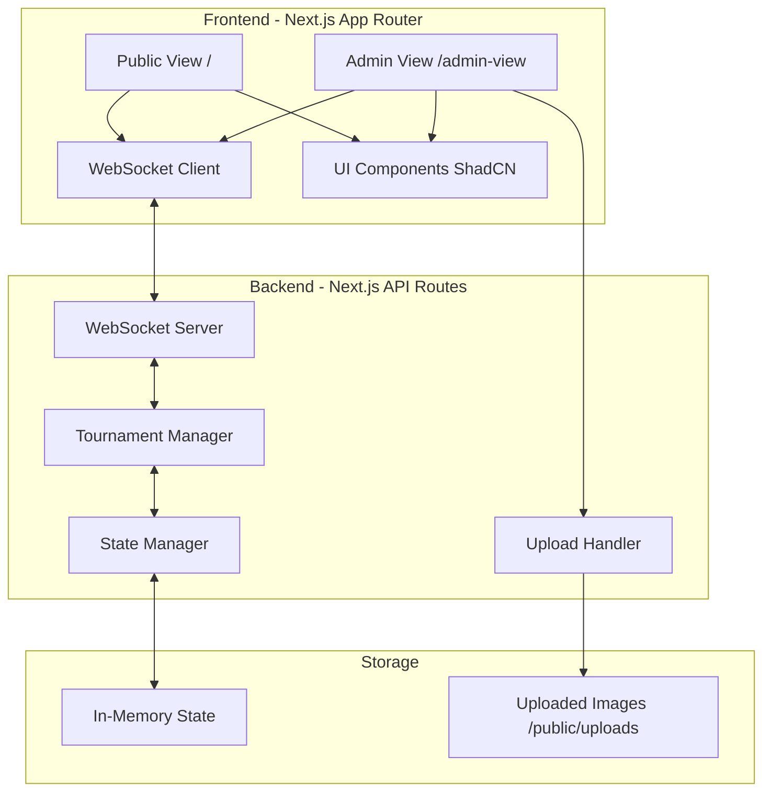

# Design Document - Campeonato de Memes

## Overview

O Campeonato de Memes é uma aplicação web full-stack construída com Next.js 14+ (App Router), React, TypeScript e WebSocket para comunicação em tempo real. A arquitetura segue o padrão de "Backend como fonte única de verdade", onde todo o estado do torneio é gerenciado centralmente pelo servidor e distribuído para todos os clientes via WebSocket.

A aplicação consiste em duas interfaces principais:
- **Tela Pública (`/`)**: Interface para jogadores visualizarem duelos e votarem
- **Tela Administrativa (`/admin-view`)**: Interface para configurar, iniciar e monitorar o torneio

A escolha de biblioteca de componentes será **ShadCN UI** com Tailwind CSS, proporcionando um design system moderno, acessível e altamente customizável.

## Architecture

### High-Level Architecture



### Technology Stack

- **Framework**: Next.js 14+ (App Router)
- **Language**: TypeScript
- **UI Library**: ShadCN UI + Tailwind CSS
- **WebSocket**: Socket.IO (client & server)
- **File Upload**: Formidable (multipart form parsing)
- **Image Validation**: Sharp (image processing and validation)
- **State Management**: React hooks (useState, useEffect) + WebSocket events
- **Animations**: Framer Motion

### Architecture Patterns

1. **Event-Driven Architecture**: WebSocket events drive all state changes
2. **Single Source of Truth**: Backend maintains authoritative state
3. **Reactive UI**: Frontend reacts to state snapshots from backend
4. **Stateless Frontend**: No local state management for tournament logic
5. **Server-Side Timer**: Backend controls all time-based events

## Components and Interfaces

### Frontend Components

#### Public View Components (`/`)

1. **WaitingScreen**
   - Displays "Sessão ainda não iniciada" message
   - Full-screen centered layout
   - Animated background

2. **DuelView**
   - Displays two memes side-by-side
   - Vote buttons for each meme
   - Vote counter display
   - Timer countdown
   - Responsive layout (stacks vertically on mobile)

3. **MemeCard**
   - Image display with aspect ratio preservation
   - Caption text
   - Vote button
   - Vote count badge
   - Hover effects and animations

4. **Timer**
   - Circular progress indicator
   - Remaining time display
   - Color changes based on urgency (green → yellow → red)

5. **WinnerScreen**
   - Champion meme display (large, centered)
   - "Meme do Ano" title with confetti animation
   - Caption display

#### Admin View Components (`/admin-view`)

1. **UploadZone**
   - Drag-and-drop area
   - File input fallback
   - Multiple file support
   - Upload progress indicators
   - Error messages for invalid files

2. **MemeList**
   - Grid of uploaded memes
   - Preview thumbnails
   - Editable caption fields
   - Delete button for each meme
   - Reorder functionality (optional)

3. **TournamentConfig**
   - Voting time input (seconds)
   - Start tournament button (disabled until ≥2 memes)
   - Tournament status indicator

4. **AdminDuelView**
   - Current duel display
   - Real-time vote counters
   - Timer display
   - Match info (round, match index)

5. **BracketVisualization**
   - Tree structure showing all matches
   - Visual indicators for:
     - Completed matches (winner highlighted)
     - Current match (pulsing border)
     - Upcoming matches (grayed out)
   - Round labels

### Backend Components

#### WebSocket Server (`/server/websocket.ts`)

Manages all real-time communication:
- Connection handling
- Event routing
- State broadcasting
- Client tracking

**Events Emitted to Clients:**
- `state:update` - Full tournament state snapshot
- `error` - Error messages

**Events Received from Clients:**
- `vote:cast` - Player vote submission
- `admin:start` - Start tournament command
- `admin:upload` - Image upload notification

#### Tournament Manager (`/server/tournament-manager.ts`)

Core business logic:
- Bracket generation (single-elimination)
- Match progression
- Winner calculation
- State transitions

**Key Methods:**
- `initializeTournament(memes: Meme[], votingTime: number): void`
- `startNextMatch(): void`
- `processVote(matchId: string, choice: 'LEFT' | 'RIGHT'): void`
- `calculateWinner(): Meme`
- `advanceWinner(winner: Meme): void`

#### State Manager (`/server/state-manager.ts`)

Manages in-memory state:
- Tournament state storage
- State mutation methods
- State snapshot generation
- State validation

**State Structure:**
```typescript
interface TournamentState {
  status: 'WAITING' | 'DUEL_IN_PROGRESS' | 'TOURNAMENT_FINISHED';
  memes: Meme[];
  bracket: Round[];
  currentMatch: Match | null;
  winner: Meme | null;
  config: {
    votingTimeSeconds: number;
  };
}
```

#### Repository Interfaces (`/server/repositories/`)

To ensure easy substitution of persistence mechanisms (Liskov Substitution Principle), we define abstract repository interfaces:

**ITournamentRepository**
```typescript
interface ITournamentRepository {
  // State operations
  getState(): Promise<TournamentState | null>;
  setState(state: TournamentState): Promise<void>;
  clearState(): Promise<void>;
  
  // Meme operations
  addMeme(meme: Meme): Promise<void>;
  getMemes(): Promise<Meme[]>;
  getMemeById(id: string): Promise<Meme | null>;
  deleteMeme(id: string): Promise<void>;
  
  // Match operations
  updateMatch(match: Match): Promise<void>;
  getMatchById(id: string): Promise<Match | null>;
}
```

**Implementations:**

1. **InMemoryTournamentRepository** (`/server/repositories/in-memory-repository.ts`)
   - Stores all data in JavaScript objects/Maps
   - Fast access, no I/O overhead
   - Data lost on server restart
   - Used for MVP

2. **DatabaseTournamentRepository** (future implementation)
   - Stores data in PostgreSQL/MongoDB/etc
   - Persistent across restarts
   - Supports querying and indexing
   - Can be swapped in without changing business logic

**Dependency Injection:**

The Tournament Manager receives the repository through constructor injection:

```typescript
class TournamentManager {
  constructor(private repository: ITournamentRepository) {}
  
  async initializeTournament(memes: Meme[], votingTime: number): Promise<void> {
    // Uses this.repository.setState() instead of direct state access
  }
}
```

This design ensures:
- Business logic is decoupled from persistence details
- Any implementation of ITournamentRepository can be used
- Easy testing with mock repositories
- Future migration to database requires only creating new implementation

#### Upload Handler (`/app/api/upload/route.ts`)

Handles image uploads:
- Multipart form parsing
- File validation (size, type)
- Image processing
- File storage
- Response generation

### API Routes

1. **POST /api/upload**
   - Accepts multipart/form-data
   - Validates file size (≤5MB)
   - Validates file type (PNG, JPG, JPEG, WEBP)
   - Stores files in `/public/uploads`
   - Returns uploaded file metadata

2. **GET /api/memes**
   - Returns list of uploaded memes
   - Used for initial state hydration

3. **DELETE /api/memes/:id**
   - Removes meme from tournament
   - Deletes associated file

## Data Models

### Meme

```typescript
interface Meme {
  id: string;              // UUID
  imageUrl: string;        // Relative path: /uploads/[filename]
  caption: string;         // Short text description
  uploadedAt: Date;        // Timestamp
}
```

### Match

```typescript
interface Match {
  id: string;              // UUID
  roundIndex: number;      // 0-based round number
  matchIndex: number;      // Position within round
  leftMeme: Meme;
  rightMeme: Meme;
  votes: {
    left: number;
    right: number;
  };
  timeRemaining: number;   // Seconds
  totalTime: number;       // Seconds
  status: 'PENDING' | 'IN_PROGRESS' | 'COMPLETED';
  winner: Meme | null;
  startedAt: Date | null;
  completedAt: Date | null;
}
```

### Round

```typescript
interface Round {
  roundIndex: number;      // 0-based
  matches: Match[];
  completed: boolean;
}
```

### TournamentState

```typescript
interface TournamentState {
  status: 'WAITING' | 'DUEL_IN_PROGRESS' | 'TOURNAMENT_FINISHED';
  memes: Meme[];
  bracket: Round[];
  currentMatch: Match | null;
  winner: Meme | null;
  config: {
    votingTimeSeconds: number;
  };
}
```

### WebSocket Messages

#### State Update (Server → Client)

```typescript
interface StateUpdateMessage {
  type: 'state:update';
  payload: TournamentState;
}
```

#### Vote Cast (Client → Server)

```typescript
interface VoteCastMessage {
  type: 'vote:cast';
  payload: {
    matchId: string;
    choice: 'LEFT' | 'RIGHT';
  };
}
```

#### Start Tournament (Client → Server)

```typescript
interface StartTournamentMessage {
  type: 'admin:start';
  payload: {
    votingTimeSeconds: number;
  };
}
```

#### Error (Server → Client)

```typescript
interface ErrorMessage {
  type: 'error';
  payload: {
    message: string;
    code: string;
  };
}
```


## Correctness Properties

*A property is a characteristic or behavior that should hold true across all valid executions of a system-essentially, a formal statement about what the system should do. Properties serve as the bridge between human-readable specifications and machine-verifiable correctness guarantees.*

### Property 1: UI State Synchronization

*For any* tournament state snapshot received via WebSocket, the frontend UI should immediately reflect that state without maintaining independent tournament logic.

**Validates: Requirements 1.3**

### Property 2: Timer Display Consistency

*For any* tournament state with an active duel (status='DUEL_IN_PROGRESS'), the UI should display the timeRemaining value from the backend state.

**Validates: Requirements 1.5**

### Property 3: Vote Event Emission

*For any* valid match ID and vote choice ('LEFT' or 'RIGHT'), clicking a vote button should emit a WebSocket event with the correct matchId and choice.

**Validates: Requirements 2.1**

### Property 4: Vote Button Enablement

*For any* tournament state where the current match has timeRemaining > 0 and status='IN_PROGRESS', vote buttons should be enabled for players.

**Validates: Requirements 2.2**

### Property 5: Vote Count Display

*For any* tournament state with vote counts in the current match, the UI should display those exact vote counts.

**Validates: Requirements 2.4**

### Property 6: Vote Rejection After Timeout

*For any* vote event received when the current match has timeRemaining ≤ 0 or status ≠ 'IN_PROGRESS', the backend should reject the vote.

**Validates: Requirements 2.5**

### Property 7: File Size Validation

*For any* uploaded file with size > 5MB, the backend should reject it with an appropriate error message. For any file with size ≤ 5MB, it should pass size validation.

**Validates: Requirements 3.2**

### Property 8: File Type Validation

*For any* uploaded file with MIME type not in ['image/png', 'image/jpeg', 'image/jpg', 'image/webp'], the backend should reject it with an appropriate error message.

**Validates: Requirements 3.3**

### Property 9: Upload Error Handling

*For any* file that fails validation (size or type), the system should return an error response with a specific error message indicating the validation failure.

**Validates: Requirements 3.4**

### Property 10: Meme Preview Display

*For any* successfully uploaded meme, the admin UI should display a preview of the image with an editable caption field.

**Validates: Requirements 3.5**

### Property 11: Start Button Enablement

*For any* tournament state with fewer than 2 memes, the "Iniciar torneio" button should be disabled in the admin UI.

**Validates: Requirements 4.2**

### Property 12: Configuration Storage

*For any* valid voting time value (positive integer), when stored in the configuration, it should be retrievable with the same value.

**Validates: Requirements 4.3**

### Property 13: Bracket Generation

*For any* set of n memes where n ≥ 2, the backend should generate a valid single-elimination bracket with ceil(log2(n)) rounds and correct match pairings.

**Validates: Requirements 4.4**

### Property 14: Tournament Start Broadcast

*For any* tournament initialization, all connected WebSocket clients should receive a state update with status='DUEL_IN_PROGRESS' and a valid currentMatch.

**Validates: Requirements 4.5**

### Property 15: Admin Match Display

*For any* tournament state with a current match, the admin UI should display both the left and right memes of that match.

**Validates: Requirements 5.1**

### Property 16: Admin Vote Count Display

*For any* tournament state with votes in the current match, the admin UI should display the vote counts for both left and right memes.

**Validates: Requirements 5.2**

### Property 17: Winner Calculation

*For any* match where timeRemaining reaches 0, the backend should calculate the winner as the meme with the higher vote count.

**Validates: Requirements 5.3**

### Property 18: Tie Breaking

*For any* match where timeRemaining reaches 0 and both memes have equal vote counts, the backend should randomly select one meme as the winner.

**Validates: Requirements 5.4**

### Property 19: Tournament Progression

*For any* completed match, the backend should either start the next match in the current round, advance to the next round, or finish the tournament if it was the final match.

**Validates: Requirements 5.5**

### Property 20: Bracket Visualization

*For any* tournament state with completed matches, the bracket visualization should indicate which memes won and which were eliminated.

**Validates: Requirements 6.2**

### Property 21: Bracket Structure

*For any* generated bracket, matches should be organized by rounds with each match containing exactly two memes.

**Validates: Requirements 6.3**

### Property 22: Round Progression

*For any* completed round, the winners should be correctly assigned to matches in the next round, maintaining bracket structure integrity.

**Validates: Requirements 6.4**

### Property 23: State Structure Completeness

*For any* tournament state maintained by the backend, it should contain all required fields: memes array, bracket array, status, currentMatch, winner, and config.

**Validates: Requirements 7.1**

### Property 24: State Change Broadcasting

*For any* mutation to the tournament state, the backend should broadcast the updated state snapshot to all connected WebSocket clients.

**Validates: Requirements 7.2**

### Property 25: Timer Decrement

*For any* active match, the backend should decrement timeRemaining at regular intervals (every second) and broadcast state updates.

**Validates: Requirements 7.4**

### Property 26: Vote Validation

*For any* vote event received by the backend, it should validate that the current match status is 'IN_PROGRESS' before incrementing vote counts.

**Validates: Requirements 7.5**

### Property 27: Repository Interface Abstraction

*For any* repository implementation conforming to ITournamentRepository, the Tournament Manager should operate correctly without modification to its business logic.

**Validates: Requirements 10.2, 10.5**

### Property 28: Repository Method Substitutability

*For any* valid tournament state, storing it via any ITournamentRepository implementation and then retrieving it should return an equivalent state object.

**Validates: Requirements 10.4**

### Property 29: Persistence Layer Isolation

*For any* business logic operation in Tournament Manager, it should access data exclusively through the ITournamentRepository interface and not through concrete implementations.

**Validates: Requirements 10.3**

## Error Handling

### Frontend Error Handling

1. **WebSocket Connection Errors**
   - Display reconnection indicator
   - Attempt automatic reconnection with exponential backoff
   - Show error message if connection fails after 5 attempts

2. **Upload Errors**
   - Display specific error messages for:
     - File too large (>5MB)
     - Invalid file type
     - Network errors
   - Allow retry without losing other uploaded files

3. **Invalid State Errors**
   - Log unexpected state structures to console
   - Display generic error message to user
   - Attempt to recover by requesting fresh state

### Backend Error Handling

1. **WebSocket Errors**
   - Log connection errors
   - Clean up disconnected clients
   - Handle malformed messages gracefully

2. **Upload Validation Errors**
   - Return 400 status with specific error message
   - Validate file size before processing
   - Validate MIME type using file headers

3. **Tournament Logic Errors**
   - Validate state transitions
   - Prevent invalid operations (e.g., voting after time expires)
   - Log unexpected errors for debugging

4. **Timer Errors**
   - Handle timer cleanup on match completion
   - Prevent multiple timers running simultaneously
   - Recover from timer failures

## Testing Strategy

### Unit Testing

We will use **Vitest** as the testing framework for unit tests, providing fast execution and excellent TypeScript support.

**Unit Test Coverage:**

1. **Backend Logic Tests**
   - Tournament Manager: bracket generation, winner calculation, progression logic
   - State Manager: state mutations, validation
   - Upload Handler: file validation logic
   - WebSocket: event routing, message formatting

2. **Frontend Component Tests**
   - Component rendering with different props
   - Event handler execution
   - Conditional rendering logic

3. **Utility Function Tests**
   - Helper functions
   - Data transformations
   - Validation functions

**Example Unit Tests:**
- Test that bracket generation creates correct number of rounds for 4, 8, 16 memes
- Test that winner calculation returns meme with higher votes
- Test that file validation rejects files over 5MB
- Test that MemeCard component renders image and caption correctly

### Property-Based Testing

We will use **fast-check** as the property-based testing library for JavaScript/TypeScript.

**Configuration:**
- Each property test should run a minimum of 100 iterations
- Each property test must be tagged with a comment referencing the correctness property from this design document
- Tag format: `**Feature: meme-championship, Property {number}: {property_text}**`

**Property Test Coverage:**

Property tests will validate universal behaviors across all valid inputs:

1. **State Synchronization Properties**
   - UI reflects any valid state snapshot
   - Timer display matches backend timeRemaining
   - Vote counts display matches backend vote counts

2. **Validation Properties**
   - File size validation rejects files >5MB
   - File type validation rejects invalid MIME types
   - Vote validation rejects votes when match is not IN_PROGRESS

3. **Tournament Logic Properties**
   - Bracket generation creates valid structure for any n≥2 memes
   - Winner calculation selects meme with higher votes
   - Tie breaking randomly selects winner when votes are equal
   - Tournament progression advances correctly after any match completion

4. **WebSocket Properties**
   - State changes trigger broadcasts to all clients
   - Vote events contain correct matchId and choice
   - Configuration storage preserves values

**Example Property Tests:**
- For any set of memes (n≥2), bracket generation creates ceil(log2(n)) rounds
- For any match with unequal votes, winner is the meme with more votes
- For any file size >5MB, validation returns error
- For any valid state snapshot, UI renders without errors
- For any repository implementation (InMemory or future Database), Tournament Manager operations produce same results
- For any tournament state, round-trip through repository (save then load) preserves state equality

### Integration Testing

**Playwright MCP for Exploratory Testing:**

Use Playwright MCP to validate end-to-end flows:

1. **Initial State Flow**
   - Navigate to `/`
   - Verify "Sessão ainda não iniciada" message displays
   - Take screenshot

2. **Admin Setup Flow**
   - Navigate to `/admin-view`
   - Upload 4 test images
   - Add captions to each
   - Set voting time to 10 seconds
   - Verify start button becomes enabled
   - Take screenshot

3. **Tournament Flow**
   - Click "Iniciar torneio"
   - Verify public view shows first duel
   - Verify timer counts down
   - Cast votes from multiple browser contexts
   - Verify vote counts update
   - Wait for match to complete
   - Verify next match starts
   - Take screenshots at each stage

4. **Winner Flow**
   - Complete all matches
   - Verify winner screen displays
   - Verify "Meme do Ano" indicator
   - Take screenshot

### Test Execution

- Unit tests: Run with `npm test`
- Property tests: Included in unit test suite
- Integration tests: Manual execution with Playwright MCP
- Coverage target: >80% for critical business logic

