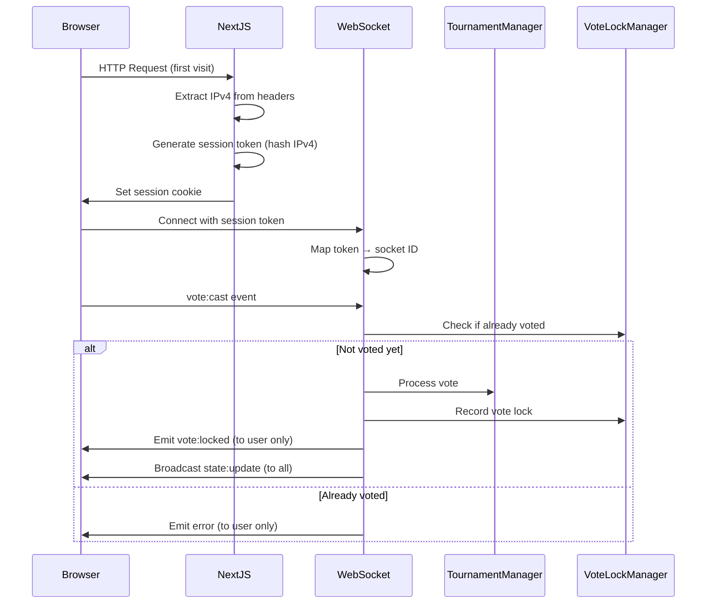

# Design Document: Vote-Once-Per-User System

## Overview

This design implements a robust vote-once-per-user system for the meme tournament application. The system uses IPv4-based session tokens to uniquely identify users across browser sessions and refreshes, preventing duplicate votes while maintaining a seamless user experience.

The solution consists of three main components:
1. **Session Token Generation**: Server-side deterministic hashing of IPv4 addresses
2. **Connection Mapping**: Server-side tracking of session tokens to active WebSocket connections
3. **Vote Lock Management**: Per-user, per-match vote tracking with targeted UI updates

## Architecture

### High-Level Flow

```
User Request → Extract IPv4 → Generate Session Token → Store in Cookie
                                                     ↓
                                    Track Socket Connection in Map
                                                     ↓
                              Vote Event → Validate → Record Vote Lock
                                                     ↓
                              Broadcast Lock ONLY to User's Sockets
```

### Component Interaction



## Components and Interfaces

### 1. Session Token Generator

**Location**: `server/session-token.ts`

**Purpose**: Generate deterministic session tokens from IPv4 addresses

```typescript
interface SessionTokenGenerator {
  /**
   * Generate a session token from an IPv4 address
   * Uses HMAC-SHA256 with server-side salt for security
   * @param ipv4 - The user's IPv4 address
   * @returns Deterministic session token (hex string)
   */
  generateToken(ipv4: string): string;
  
  /**
   * Extract IPv4 address from Socket.IO socket
   * Handles X-Forwarded-For and X-Real-IP headers for proxies
   * @param socket - Socket.IO socket instance
   * @returns IPv4 address or fallback identifier
   */
  extractIPv4(socket: Socket): string;
}
```

**Implementation Details**:
- Uses `crypto.createHmac('sha256', SECRET_SALT)` for hashing
- Salt stored in environment variable `SESSION_TOKEN_SALT`
- Fallback to socket.id if IPv4 cannot be determined
- Handles proxy headers: `X-Forwarded-For`, `X-Real-IP`

### 2. Connection Map Manager

**Location**: `server/connection-map.ts`

**Purpose**: Track mapping of session tokens to active WebSocket connections

```typescript
interface ConnectionMapManager {
  /**
   * Add a socket connection for a session token
   * @param sessionToken - User's session token
   * @param socketId - Socket.IO socket ID
   */
  addConnection(sessionToken: string, socketId: string): void;
  
  /**
   * Remove a socket connection
   * @param socketId - Socket.IO socket ID to remove
   */
  removeConnection(socketId: string): void;
  
  /**
   * Get all socket IDs for a session token
   * @param sessionToken - User's session token
   * @returns Array of active socket IDs
   */
  getSocketIds(sessionToken: string): string[];
  
  /**
   * Get session token for a socket ID
   * @param socketId - Socket.IO socket ID
   * @returns Session token or null
   */
  getSessionToken(socketId: string): string | null;
  
  /**
   * Clean up stale connections (optional maintenance)
   */
  cleanup(): void;
}
```

**Data Structure**:
```typescript
class ConnectionMapManager {
  // Map: sessionToken → Set<socketId>
  private tokenToSockets: Map<string, Set<string>>;
  
  // Map: socketId → sessionToken (reverse lookup)
  private socketToToken: Map<string, string>;
}
```

### 3. Vote Lock Manager

**Location**: `server/vote-lock-manager.ts`

**Purpose**: Track which users have voted in which matches

```typescript
interface VoteLockManager {
  /**
   * Check if a user has already voted in a match
   * @param sessionToken - User's session token
   * @param matchId - Match ID
   * @returns true if user has already voted
   */
  hasVoted(sessionToken: string, matchId: string): boolean;
  
  /**
   * Record that a user has voted in a match
   * @param sessionToken - User's session token
   * @param matchId - Match ID
   */
  recordVote(sessionToken: string, matchId: string): void;
  
  /**
   * Clear vote locks for a specific match (when match completes)
   * @param matchId - Match ID
   */
  clearMatchLocks(matchId: string): void;
  
  /**
   * Clear all vote locks (when tournament ends)
   */
  clearAllLocks(): void;
  
  /**
   * Get all users who voted in a match (for debugging)
   * @param matchId - Match ID
   * @returns Array of session tokens
   */
  getVotersForMatch(matchId: string): string[];
}
```

**Data Structure**:
```typescript
class VoteLockManager {
  // Map: matchId → Set<sessionToken>
  private matchVotes: Map<string, Set<string>>;
}
```

### 4. Enhanced WebSocket Server

**Location**: `server/websocket.ts` (modifications)

**New Methods**:
```typescript
class WebSocketServer {
  private connectionMap: ConnectionMapManager;
  private voteLockManager: VoteLockManager;
  private sessionTokenGenerator: SessionTokenGenerator;
  
  /**
   * Emit event to all sockets belonging to a session token
   * @param sessionToken - Target user's session token
   * @param event - Event name
   * @param data - Event payload
   */
  private emitToUser(sessionToken: string, event: string, data: any): void;
  
  /**
   * Handle socket connection with session token extraction
   */
  private handleConnection(socket: Socket): void;
  
  /**
   * Enhanced vote handler with vote lock checking
   */
  private async handleVoteCast(socket: Socket, payload: VoteCastMessage['payload']): Promise<void>;
}
```

### 5. Session Cookie Middleware

**Location**: `server/session-middleware.ts`

**Purpose**: Set session token cookie on HTTP requests

```typescript
interface SessionMiddleware {
  /**
   * Express/Next.js middleware to set session cookie
   * @param req - HTTP request
   * @param res - HTTP response
   * @param next - Next middleware function
   */
  setSessionCookie(req: Request, res: Response, next: NextFunction): void;
}
```

**Cookie Configuration**:
```typescript
{
  name: 'meme_session',
  httpOnly: false,  // Needs to be readable by client for WebSocket
  secure: process.env.NODE_ENV === 'production',
  sameSite: 'strict',
  maxAge: 7 * 24 * 60 * 60 * 1000,  // 7 days
  path: '/'
}
```

### 6. Client-Side Session Handler

**Location**: `hooks/useWebSocket.ts` (modifications)

**New Functionality**:
```typescript
// Read session token from cookie
function getSessionToken(): string | null;

// Include session token in WebSocket connection
const socket = io({
  auth: {
    sessionToken: getSessionToken()
  }
});

// Handle vote:locked event
socket.on('vote:locked', (payload: { matchId: string }) => {
  // Update local state to disable buttons
});
```

## Data Models

### Session Token
```typescript
type SessionToken = string;  // Hex-encoded SHA256 hash (64 characters)
```

### Vote Lock Entry
```typescript
interface VoteLockEntry {
  sessionToken: SessionToken;
  matchId: string;
  votedAt: Date;
}
```

### Connection Entry
```typescript
interface ConnectionEntry {
  sessionToken: SessionToken;
  socketId: string;
  connectedAt: Date;
}
```

### WebSocket Events (New)

```typescript
// Client → Server: Include session token in auth
interface SocketAuth {
  sessionToken: string;
}

// Server → Client: Vote locked notification (targeted)
interface VoteLockedMessage {
  type: 'vote:locked';
  payload: {
    matchId: string;
  };
}

// Server → Client: Vote rejected (targeted)
interface VoteRejectedMessage {
  type: 'vote:rejected';
  payload: {
    matchId: string;
    reason: 'ALREADY_VOTED' | 'MATCH_NOT_ACTIVE';
  };
}
```

## Correctness Properties

*A property is a characteristic or behavior that should hold true across all valid executions of a system-essentially, a formal statement about what the system should do. Properties serve as the bridge between human-readable specifications and machine-verifiable correctness guarantees.*

### Property 1: Session Token Determinism
*For any* IPv4 address, generating a session token multiple times should always produce the same token value.
**Validates: Requirements 2.2, 2.3**

### Property 2: Vote Lock Enforcement
*For any* session token and match ID, if a vote has been recorded, subsequent vote attempts for the same match should be rejected.
**Validates: Requirements 1.3**

### Property 3: Connection Map Consistency
*For any* session token, the set of socket IDs returned by `getSocketIds` should exactly match the socket IDs that were added via `addConnection` and not removed via `removeConnection`.
**Validates: Requirements 3.1, 3.2, 3.3**

### Property 4: Targeted Broadcast Isolation
*For any* session token and event emission, only sockets belonging to that session token should receive the event, and no sockets belonging to other session tokens should receive it.
**Validates: Requirements 4.2, 4.3**

### Property 5: Vote Lock Cleanup
*For any* match ID, after calling `clearMatchLocks`, no session tokens should be marked as having voted in that match.
**Validates: Requirements 4.5**

### Property 6: IPv4 Extraction Consistency
*For any* socket with the same underlying IPv4 address (even with different proxy headers), the extracted IPv4 should be consistent.
**Validates: Requirements 6.2**

### Property 7: Cookie Persistence
*For any* user session, if a session token cookie is set, subsequent requests from the same browser should include the same session token value.
**Validates: Requirements 2.4**

### Property 8: Multi-Browser Same-IP Detection
*For any* two connections from different browsers but the same IPv4 address, both should generate identical session tokens.
**Validates: Requirements 1.5, 2.3**

## Error Handling

### Error Scenarios

1. **IPv4 Extraction Failure**
   - Fallback to socket.id as identifier
   - Log warning for monitoring
   - Continue with degraded functionality

2. **Duplicate Vote Attempt**
   - Reject vote with `ALREADY_VOTED` error
   - Send targeted error message to user
   - Do not update vote counts

3. **Session Token Missing**
   - Generate new token on server side
   - Set cookie in response
   - Allow connection to proceed

4. **Stale Socket in Connection Map**
   - Remove on disconnect event
   - Periodic cleanup of orphaned entries
   - Graceful handling of missing entries

5. **Match Not Found**
   - Return `MATCH_NOT_ACTIVE` error
   - Do not record vote lock
   - Log for debugging

### Error Messages

```typescript
enum VoteErrorCode {
  ALREADY_VOTED = 'ALREADY_VOTED',
  MATCH_NOT_ACTIVE = 'MATCH_NOT_ACTIVE',
  INVALID_SESSION = 'INVALID_SESSION',
  SERVER_ERROR = 'SERVER_ERROR'
}

interface VoteError {
  code: VoteErrorCode;
  message: string;
  matchId?: string;
}
```

## Testing Strategy

### Unit Tests

**Session Token Generator**:
- Test deterministic token generation for same IPv4
- Test different IPv4s produce different tokens
- Test proxy header extraction (X-Forwarded-For, X-Real-IP)
- Test fallback when IPv4 unavailable

**Connection Map Manager**:
- Test adding and removing connections
- Test multiple sockets per session token
- Test reverse lookup (socket → token)
- Test cleanup of stale connections

**Vote Lock Manager**:
- Test recording and checking votes
- Test clearing match locks
- Test clearing all locks
- Test multiple users voting in same match

### Property-Based Tests

The testing strategy uses **fast-check** for property-based testing with a minimum of 100 iterations per property.

**Property 1: Session Token Determinism**
- Generate random IPv4 addresses
- Call `generateToken` multiple times for each
- Assert all calls return identical tokens
- **Validates: Requirements 2.2, 2.3**

**Property 2: Vote Lock Enforcement**
- Generate random session tokens and match IDs
- Record vote, then attempt duplicate
- Assert `hasVoted` returns true after first vote
- Assert duplicate vote is rejected
- **Validates: Requirements 1.3**

**Property 3: Connection Map Consistency**
- Generate random session tokens and socket IDs
- Perform random sequence of add/remove operations
- Assert `getSocketIds` matches expected state
- **Validates: Requirements 3.1, 3.2, 3.3**

**Property 4: Targeted Broadcast Isolation**
- Create multiple session tokens with multiple sockets each
- Emit to one session token
- Assert only that token's sockets receive event
- **Validates: Requirements 4.2, 4.3**

**Property 5: Vote Lock Cleanup**
- Generate random match IDs and session tokens
- Record votes, then clear match locks
- Assert `hasVoted` returns false after clear
- **Validates: Requirements 4.5**

**Property 6: IPv4 Extraction Consistency**
- Generate random IPv4 addresses
- Create sockets with various proxy header combinations
- Assert extracted IPv4 is consistent
- **Validates: Requirements 6.2**

**Property 7: Cookie Persistence**
- Generate random session tokens
- Simulate cookie set and subsequent requests
- Assert cookie value persists correctly
- **Validates: Requirements 2.4**

**Property 8: Multi-Browser Same-IP Detection**
- Generate random IPv4 address
- Create multiple socket connections with same IP
- Assert all generate identical session tokens
- **Validates: Requirements 1.5, 2.3**

### Integration Tests

- Test full vote flow: connection → vote → lock → rejection
- Test multi-browser scenario with same IP
- Test browser refresh maintains vote lock
- Test match completion clears locks
- Test tournament end clears all locks

### Manual Testing Scenarios

1. Vote in one browser, verify buttons disabled
2. Refresh page, verify buttons still disabled
3. Open different browser (same device), verify buttons disabled
4. Wait for match to complete, verify buttons re-enabled for next match
5. Test with VPN/proxy to verify IPv4 extraction

## Security Considerations

### Session Token Security

1. **Hashing**: Use HMAC-SHA256 with server-side salt
2. **Salt Storage**: Store salt in environment variable, never commit to repo
3. **No Raw IPs**: Never store or log raw IPv4 addresses
4. **Cookie Security**: Use `secure` flag in production, `sameSite: strict`

### Privacy Considerations

1. **IP Hashing**: IPv4 addresses are immediately hashed, never stored
2. **Minimal Logging**: Session tokens logged only for errors, not routine operations
3. **Data Retention**: Vote locks cleared after match/tournament completion
4. **Shared Networks**: Users on same network (NAT) treated as same voter (acceptable trade-off)

### Attack Vectors

1. **Cookie Manipulation**: Mitigated by server-side validation and deterministic generation
2. **IP Spoofing**: Mitigated by trusting proxy headers only from known proxies
3. **Session Hijacking**: Mitigated by short-lived sessions and match-specific locks
4. **Replay Attacks**: Mitigated by vote lock checking before processing

## Performance Considerations

### Memory Usage

- Connection Map: O(n) where n = number of active connections
- Vote Lock Map: O(m × u) where m = matches, u = users per match
- Expected: ~1000 concurrent users = ~100KB memory

### Cleanup Strategy

1. **On Disconnect**: Remove from connection map immediately
2. **On Match Complete**: Clear vote locks for that match
3. **On Tournament End**: Clear all vote locks
4. **Periodic Cleanup**: Every 5 minutes, remove stale entries

### Scalability

- Current design: Single server instance
- Future: Redis for distributed session/lock storage
- Connection map can be sharded by session token prefix

## Implementation Notes

### Environment Variables

```bash
# Required
SESSION_TOKEN_SALT=<random-64-char-hex-string>

# Optional
TRUSTED_PROXY_IPS=127.0.0.1,10.0.0.0/8
```

### Deployment Checklist

1. Generate and set `SESSION_TOKEN_SALT` in production
2. Configure `TRUSTED_PROXY_IPS` if behind load balancer
3. Enable `secure` cookie flag in production
4. Monitor vote rejection rates for anomalies
5. Set up alerts for high duplicate vote attempts

### Migration Path

1. Deploy session token generation and cookie setting
2. Deploy connection map tracking
3. Deploy vote lock manager
4. Deploy enhanced vote handler with lock checking
5. Deploy client-side vote:locked event handling
6. Monitor and adjust as needed

## Future Enhancements

1. **Redis Integration**: For multi-server deployments
2. **Rate Limiting**: Prevent vote spam attempts
3. **Admin Override**: Allow admins to reset user vote locks
4. **Vote History**: Track voting patterns for analytics
5. **Fingerprinting**: Combine IPv4 with browser fingerprint for better uniqueness
